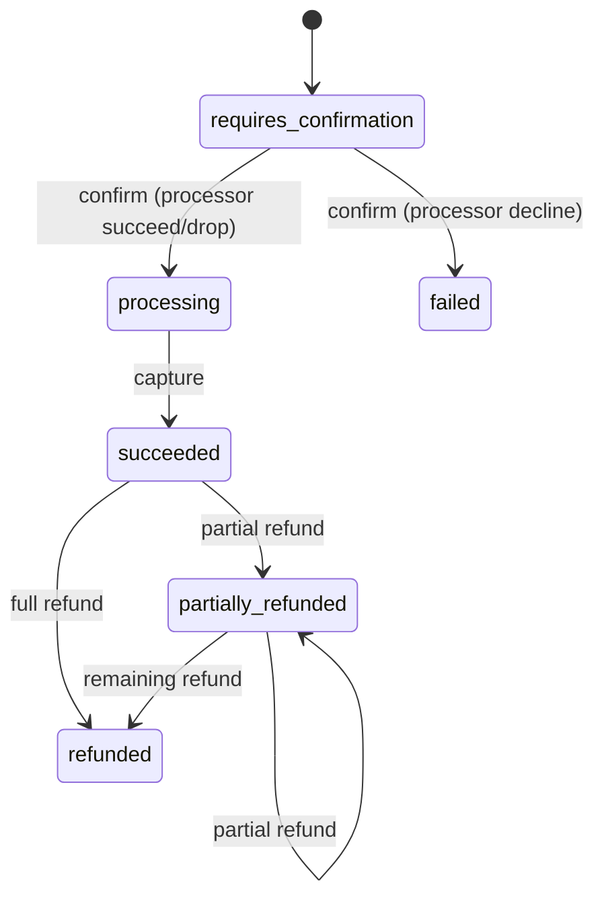

# Design notes for ledgerd

## Data model

- **api_keys** — hashed Bearer tokens. All merchant resources are scoped by `api_key_id`.
- **accounts** — `merchant` (customer-owned, non-negative available balance) and system `clearing` accounts (one per currency). Clearing can go negative; that is how card captures enter the books.
- **payment_intents** — state machine:

- **ledger_transactions** / **ledger_entries** — append-only double-entry. Every capture or refund is one transaction whose entries sum to zero per currency.
- **refunds** — one row per refund API call, pointing at its ledger transaction.
- **idempotency_keys** — stores status + response body for successful POSTs, keyed by `(api_key_id, Idempotency-Key)`.
- **processor_attempts** / **processor_charges** — simulated card processor state, committed on a separate connection from the ledger transaction.
- **events** — transactional outbox written in the same DB transaction as the domain effect. Nothing consumes it yet.

Amounts are `bigint` minor units. Floats are rejected at the JSON boundary.

## Invariants

1. For every `ledger_transactions.id`, `SUM(ledger_entries.amount_minor) = 0` (enforced by a deferred constraint trigger).
2. Merchant `available_balance_minor >= 0` (CHECK + application check under `FOR UPDATE`).
3. `amount_refunded_minor <= amount_captured_minor`.
4. At most one `ledger_transactions` row with `kind = 'capture'` per payment intent (unique partial index).
5. Materialized `accounts.available_balance_minor` equals `SUM(ledger_entries.amount_minor)` for that account after every movement (verified in `postMovement` and exposed on GET account).

## Concurrency: why `SELECT ... FOR UPDATE`

Balance mutations lock accounts with **blocking** `SELECT ... FOR UPDATE` in sorted UUID order (deadlock avoidance). Concurrent refunds wait and then observe the reduced balance. Optimistic version checks would turn ordinary contention into client-visible 409/400 noise; for money movement, waiting is the safer default.

Idempotency uses the opposite policy: `pg_try_advisory_xact_lock` so a duplicate in-flight key returns **409** immediately (Stripe-like) instead of blocking until the first request commits.

## Why the idempotency row is in the same transaction

If the effect commits and the idempotency insert fails (or the process dies between them), a retry would re-run the effect: double charge. Writing both in one transaction means either:

- the client got a response (or can replay it from the stored body), and the effect happened once, or
- neither happened, and the key is free to retry.

Validation failures return `*APIError` and roll the transaction back, so the key is **not** stored (matches Stripe: you can fix the request and reuse the key).

Expired keys (default 24h, `LEDGERD_IDEMPOTENCY_TTL`) are ignored on lookup; a leftover row is deleted before a fresh insert when the lock is held.

## Processor simulation

Outcomes are deterministic given `(seed, payment_intent_id, attempt)`. Scripts override the RNG for tests (`succeed`, `decline`, `timeout`, `drop`).

- **timeout** — attempt counter increments, no charge row; ledger confirm returns 503 and does not store the idempotency key, so the same key can safely retry.
- **drop** — charge + ledger confirm commit, but the HTTP layer closes the connection without a body (succeed-but-drop-the-response). Retry with the same key replays the stored 200.

Processor tables use a **separate** connection/transaction from the ledger confirm. That mirrors a real network call. For succeed/drop/decline the charge is durable before the ledger transaction updates the intent; a crash between those steps leaves a processor charge that the next confirm attempt reuses (processor-side idempotency) while the intent is still `requires_confirmation`. The next confirm then advances the ledger without double-charging the (simulated) card.

## Append-only ledger

Triggers reject `UPDATE`/`DELETE` on `ledger_entries`, `ledger_transactions`, and `events`. The demo role is the table owner (owners bypass GRANT/REVOKE), so privileges alone would not enforce append-only; the triggers are the enforcement.

## What broke during development

1. **Workspace reset mid-build** — an earlier Linux agent session wrote files under `/workspace` that were not present on the Windows checkout; the tree was rebuilt from scratch here.
2. **Local Postgres install** — scoop/winget downloads to EnterpriseDB timed out on this machine (DNS for many hosts resolved to `192.0.2.1`). Local benches therefore run when Postgres is available via Docker Compose or a local install; measured numbers in `bench/RESULTS.md` are only from runs that actually completed.
3. **Multi-statement migrations on pgx** — extended-protocol `Exec` rejects multi-statement SQL; migrations use the simple-query protocol via `PgConn.Exec`.
4. **Confirm + processor connection** — processor authorize used the same pool as the open ledger transaction. Under concurrent confirms every connection was waiting on Authorize, which needed another connection: pool deadlock. Fixed with a dedicated `ProcessorPool`.
5. **Drop-response in unit ResponseRecorders** — `httptest.ResponseRecorder` cannot hijack; the HTTP layer panics with a dedicated message when drop is requested under a non-hijackable writer, so drop tests go through the App layer (`Result.DropResponse`) instead of the recorder.
6. **First loadgen run on CI** — `ok=0 err=500` at concurrency 32 before the processor pool split; replay-only path still measured because it ran after the workers finished. Re-measured after the fix.

## Honesty boundaries

See README. This is a showcase, not a processor, not PCI scoped, and not a multi-region ledger.
